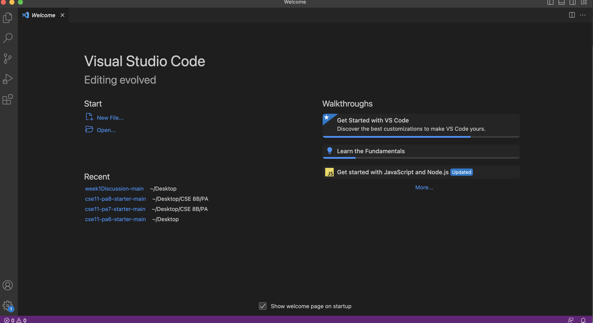
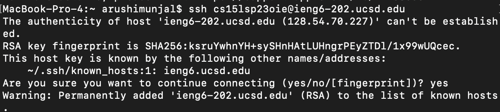
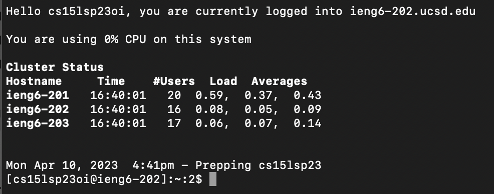
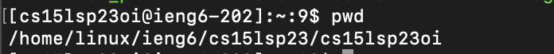
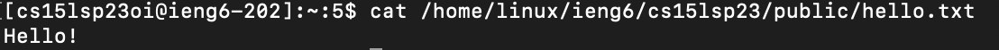

# Lab Report 1
Arushi Munjal, Lab B03

---

Step 1: Install Visual Studio Code in order to use the terminal function.

Step 2: Look up your course-specific account for CSE15L [here](https://sdacs.ucsd.edu/~icc/index.php):

Step 3. Open a terminal in VS Code. Type in the following command: `ssh cs15lsp23oi@ieng6.ucsd.edu`

> Since this is the first time you connected to this server, you will likely recieve this message:

> Type in 'yes'. Then press enter.

Step 4: You will them be prompted to enter your username. If your password does not work, reset it at the link found in Step 2. Once completed, your terminal should respond as follows:

> Wait around 15 minutes for your password to be updated if you reset it.

Step 5: Try to run some commands. Here are some examples:

1. `pwd` This will display the current working directory. `pwd` is an acronym for 'print working directory'.

2. `ls -lat` This will list all files starting with '.'

3. `cat /home/linux/ieng6/cs15lsp23/public/hello.txt` The `cat` command prints the contents of the files given by the paths after the command. Therefore, this will print the contents of the hello.txt, which is "Hello!".

Step 6: To log out of the remote server in your terminal, you can use:

- Ctrl-D
- Run the command exit
