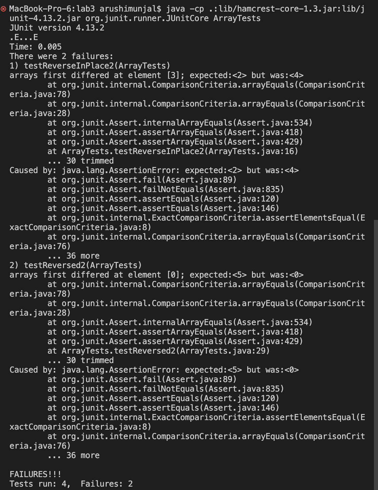
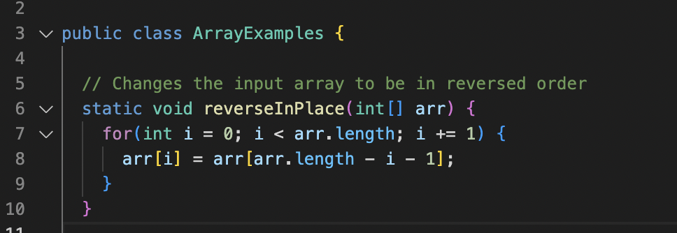
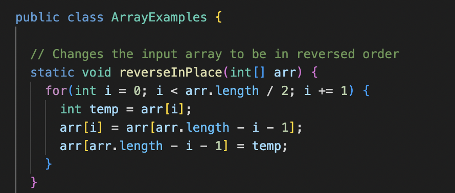

# Lab Report 2 - Servers and Bugs
Arushi Munjal, Lab B03

---

# Part 1:

## Code for StringServer: 

```

import java.io.IOException;
import java.net.URI;

class Handler implements URLHandler {
    // The one bit of state on the server: a number that will be manipulated by
    // various requests.

    String runningString = "";

    public String handleRequest(URI url) {
        if (url.getPath().contains("/add-message")) {
            String[] parameters = url.getQuery().split("=");
            if (parameters[0].equals("s")) {
                runningString += parameters[1] + "\n";
            }
        }
        return runningString;
    }
}

class StringServer {
    public static void main(String[] args) throws IOException {
        if(args.length == 0){
            System.out.println("Missing port number! Try any number between 1024 to 49151");
            return;
        }

        int port = Integer.parseInt(args[0]);

        Server.start(port, new Handler());
    }
}

``` 

## Using /add-message:

1. Trial 1


- The handleRequest method is called, as it checks the path of the URL and returns messages after the = to the server.
- The relevant argument is "Hello". The value of the field `message` is "Hello \n".
- The value is changed after the request because the handleRequest method adds the message in the query to the `message` value.


2. Trial 2


- The handleRequest method is called, as it checks the path of the URL and returns messages after the = to the server.
- The relevant argument is "Hi". The value of the field `message` is "Hello \n Hi \n".
- The value is changed after the request because the handleRequest method adds the message in the query to the `message` value.

# Part 2:

## 1. Example of a failure-inducing input for the reverseInPlace method:

```
  @Test 
	public void testReverseInPlace2() {
    int[] input1 = { 1, 2, 3, 4, 5 };
    ArrayExamples.reverseInPlace(input1);
    assertArrayEquals(new int[]{ 5, 4, 3, 2, 1 }, input1);
    
```

Causes the following symptom:




## 2. Example of input that doesn’t induce a failure for the reverseInPlace method:

```
  @Test 
	public void testReverseInPlace3() {
    int[] input1 = { 5, 1, 5 };
    ArrayExamples.reverseInPlace(input1);
    assertArrayEquals(new int[]{ 5, 1, 5 }, input1);
	}

```
Produces the following symptom, impying no failures induced:


## 3. The bug, as the before-and-after code change required to fix it:

Before:



After:



> The bug was that the code iterates up until the end of the array, rather than the middle of the array. This causes for the last half of the array to be overwritten with the reversed elements, which created merely a copy of the array rather than a reversed array. The fix was the iterate only to the middle of the array so that the entire array is properly reversed, as only the first half needs to be looped through for the entire array to be reversed. The fix addresses the issue because it creates a temp array to store the first half of the elements, swap them with the second half, and then store the temp array to the second half.


# Part 3:

Over the past two weeks, I have learned how to build and run a server, as well as implement code in order to change the output shown in the server. I found it very interesting to see how you can run the server on the local and remote computers and load other people's web pages too! I also learned about the importance of writing tester methods to check for bugs, and how it is important to identify the failure-inducing output, symptom, and bug when trying to fix the code.


