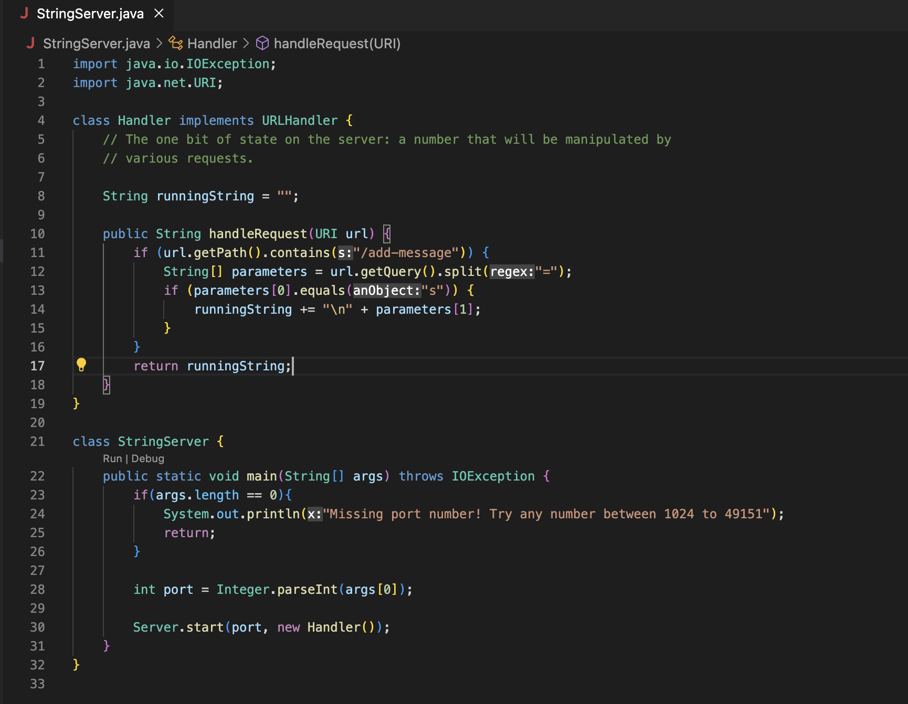
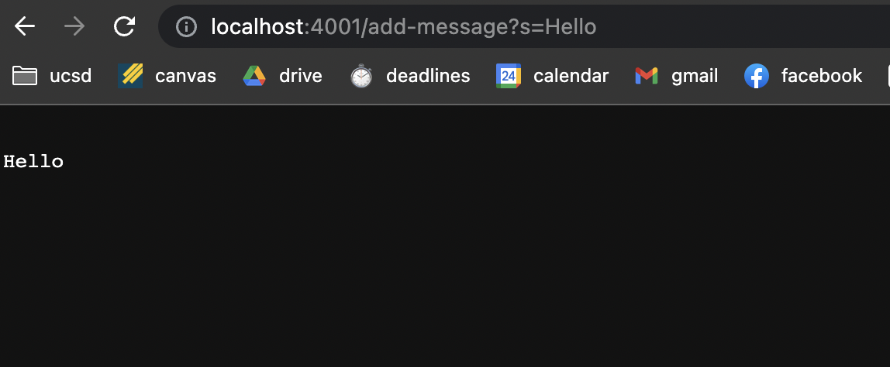
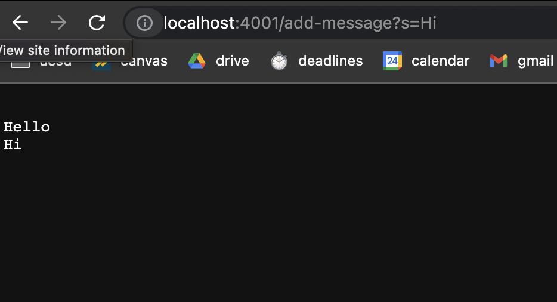

# Lab Report 2 - Servers and Bugs
Arushi Munjal, Lab B03

---

**Part 1:**

Code for StringServer: 

Using /add-message:

1. 

- The handleRequest method is called, as it checks the path of the URL and returns the string after = to the website.
- The arguments are, and the values are.
- The values change by.

2. 

- The handleRequest method is called, as it checks the path of the URL and returns the string after = to the website.
- The arguments are, and the values are.
- The values change by.

**Part 2:**

