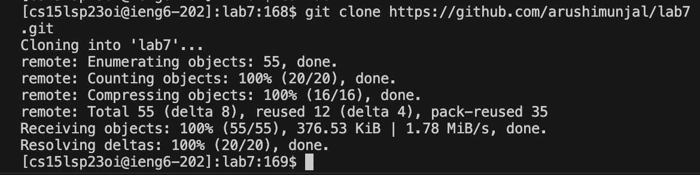
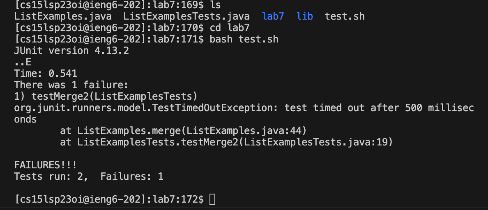
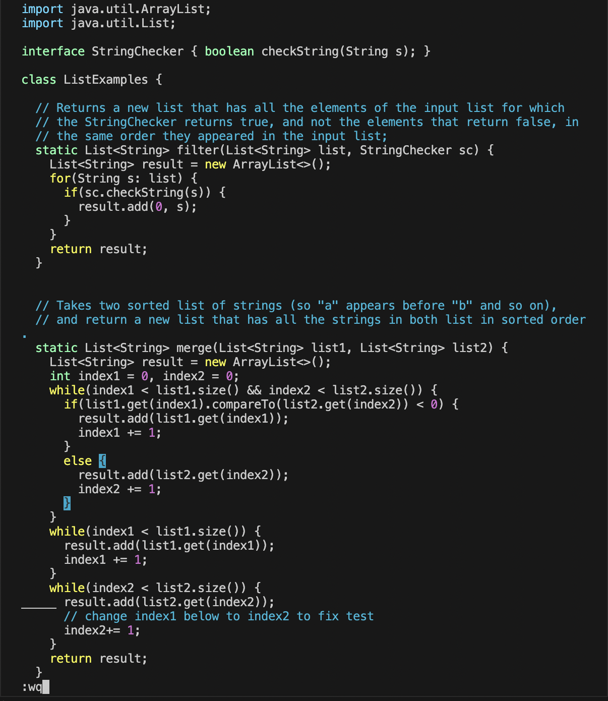
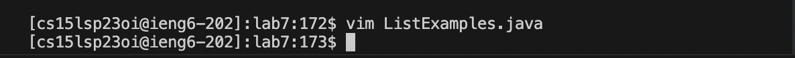
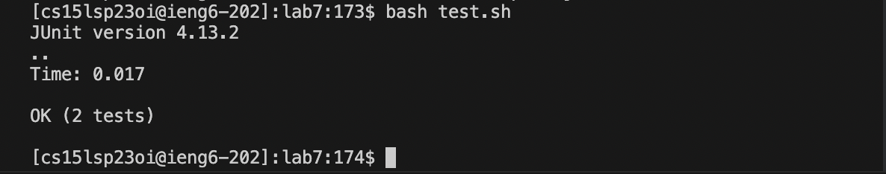
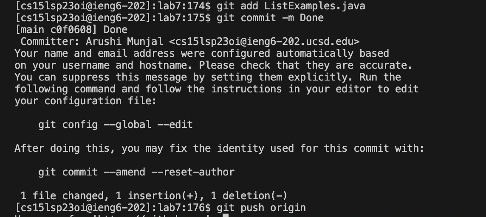

# Lab Report 4 - Editing with Vim
Arushi Munjal, Lab B03

---

**Step 1: Log into ieng6.**

```
$ ssh cs15lsp23oi@ieng.ucsd.edu <enter>
(cs15lsp23oi@ieng.ucsd.edu) Password: <paste password> <enter>
```

> To access my log in details, I used `Control + C` and `Control V` on Lab Report 1. These steps allow me to log into my remote ieng6 account.
 

  
**Step 2: Clone your fork of the repository from your Github account.**

```
$ git clone https://github.com/ucsd-cse15l-s23/lab7
```
> To access the link of the repository, I opened the link from the lab7 instructions and forked it on Github. Then, I cloned it in my terminal by using `git clone`, which clones the lab7 repository into my remote account.



**Step 3: Run the tests, demonstrating that they fail.**

```
$ ls
$ cd lab7 <enter>
$ bash t <tab> <enter>
```
 


> To run the tests, I used `ls` to find the list of files of the repo and `cd` to access and enter lab7. Then, I typed `bash t` and used <tab> to autocomplete `t` to become `test.sh`. `bash` ran the commands in the `test.sh` files.
  
**Step 4: Edit the code file to fix the failing test.**
 
```
$ vim L<tab>.java <enter>
$ /index1 <enter>
$ bash t <tab> <enter> n n n n n n n n n l l l l l r 2 <esc> :wq
```
 



> To open the ListExamples java file, I typed `vim` because that is the text editor we need to edit the code file. I typed `L` and then `tab` in order to autocomplete it to `ListExamples`. I typed `.java` and `enter` to open the java code. Then, I typed `/index` which searches for the word `index` in the code. I typed `n` 9 times to find the nineth occurance of `index` in the file and `l` 5 times in order to move around 5 characters to the right. Then, I typed `r` ans `2` which changed `index1` to become `index2`, as `r` replaces a single character and I used it to replace `1` to `2`. Finally, I pressed `esc` to escape vim's insert mode and `:wq` to save the edits.
  
**Step 5: Run the tests, demonstrating that they now succeed.**
 
```
$ bash t <tab> <enter>
```
 


> To run the tests again after editing the code, I typed `bash t` and <tab> again to autocomplete `t` to `test.sh`.
  
**Step 6: Commit and push the resulting change to your Github account.**
 
```
$ git add L<tab>.java <enter>
$ git commit -m Done <enter>
$ git push origin
```
 


> I first used `git add` to add my change in the local working directory to the repository. I typed `L` and then `tab` to autocomplete `L` to `ListExamples`, and then added `.java`. Then, I used `git commit -m` to commit the staged files and `Done` after as my comment that describes the intention of the commit. Lastly, I typed `git push origin` to finally push/upload the local branch to the repository.
