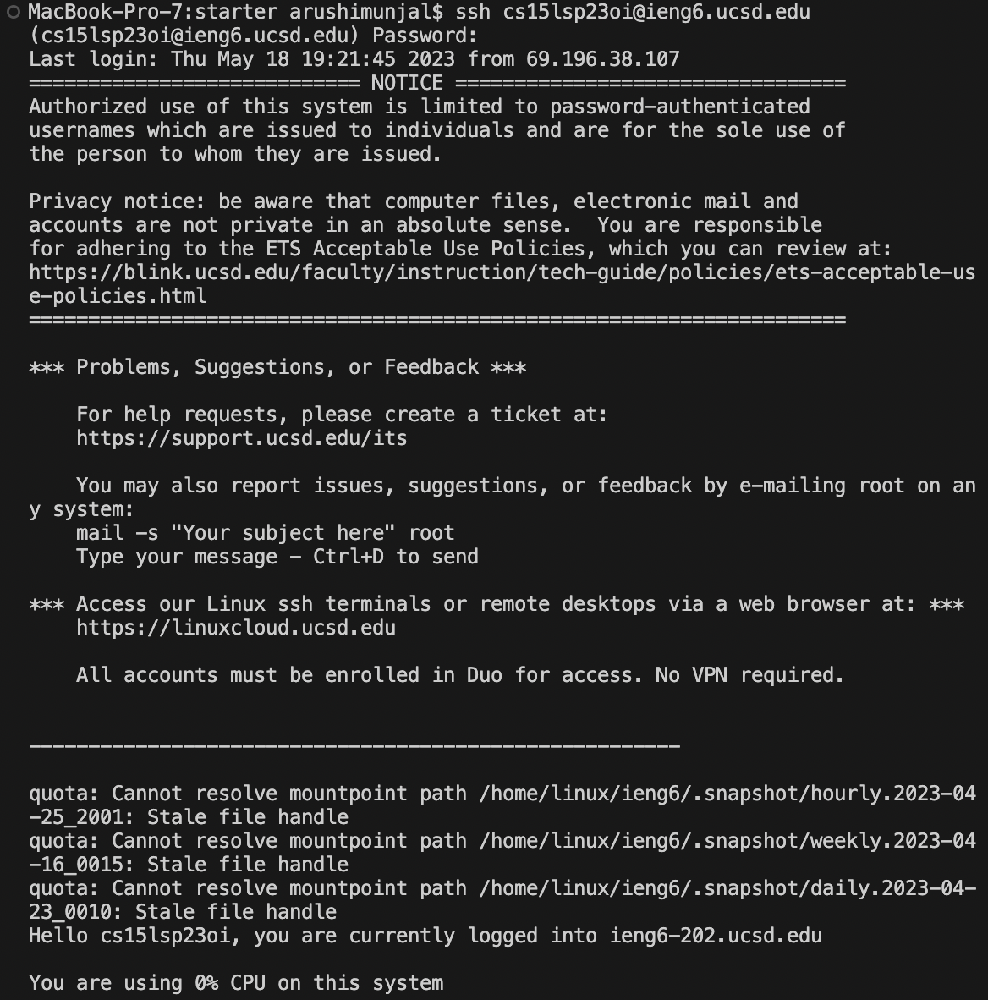

# Lab Report 4 - Editing with Vim
Arushi Munjal, Lab B03

---

**Step 1: Log into ieng6.**

```
$ ssh cs15lsp23oi@ieng.ucsd.edu <enter>
(cs15lsp23oi@ieng.ucsd.edu) Password: <paste password> <enter>
```

> To access my log in details, I used `Control + C` and `Control V` on Lab Report 1. These steps allow me to log into my remote ieng6 account.
 

  
**Step 2: Clone your fork of the repository from your Github account.**

```
$ git clone https://github.com/ucsd-cse15l-s23/lab7
```
> To access the link of the repository, I used `Control + C` and `Control V`on Githhub. `git clone` clones the repository into my remote account.


**Step 3: Run the tests, demonstrating that they fail.**

```
$ <ls>
$ <cd> <lab7> <enter>
$ bash t <tab> <enter>
```


> To run the tests, I used `ls` to find the files of the directory and `cd` to access and enter lab7. Then, I used <tab> to autocomplete `t` to become `test.sh`. `bash` ran the commands in the `test.sh` files.
  
**Step 4: Edit the code file to fix the failing test.**
  
**Step 5: Run the tests, demonstrating that they now succeed.**
  
**Step 6: Commit and push the resulting change to your Github account .**
